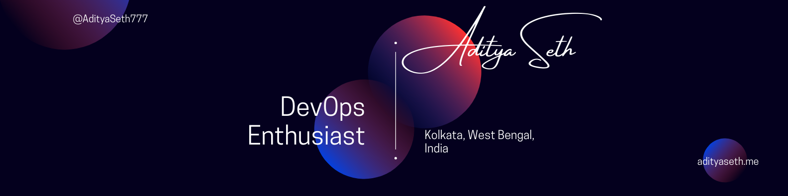
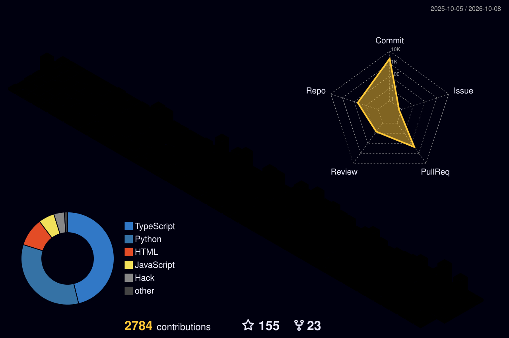

# Hola a todos !

## Click here to visit my website -> [(www.adityaseth.in)](https://adityaseth.in)

<picture>
  <source media="(prefers-color-scheme: dark)" srcset="bento-dark.svg">
  <source media="(prefers-color-scheme: light)" srcset="bento-light.svg">
  
</picture>

<picture>
  <source media="(prefers-color-scheme: dark)" srcset="https://raw.githubusercontent.com/AdityaSeth777/AdityaSeth777/output/github-snake-dark.svg">
  <source media="(prefers-color-scheme: light)" srcset="https://raw.githubusercontent.com/AdityaSeth777/AdityaSeth777/output/github-snake.svg">
  
</picture>

### Wanna listen to what I am listening to ? :)

 
  

  

## Life outside the terminal

<table>
<tr>
<td width="50%">
<picture>
  <source media="(prefers-color-scheme: dark)" srcset="photos-dark.svg">
  <source media="(prefers-color-scheme: light)" srcset="photos-light.svg">
  
</picture>
</td>
<td width="50%">
<picture>
  <source media="(prefers-color-scheme: dark)" srcset="travel-dark.svg">
  <source media="(prefers-color-scheme: light)" srcset="travel-light.svg">
  
</picture>
</td>
</tr>
<tr>
<td width="50%">
<picture>
  <source media="(prefers-color-scheme: dark)" srcset="now-dark.svg">
  <source media="(prefers-color-scheme: light)" srcset="now-light.svg">
  
</picture>
</td>
<td width="50%">
<picture>
  <source media="(prefers-color-scheme: dark)" srcset="weather-dark.svg">
  <source media="(prefers-color-scheme: light)" srcset="weather-light.svg">
  
</picture>
</td>
</tr>
</table>

*Travel photos are on their way — drop JPEG/PNG/HEIC files into [`photos/travel/`](photos/travel/) and they'll show up here automatically on the next scheduled run. Add trips to [`data/trips.yml`](data/trips.yml) to plot the flight log.*

## 💻 My workspace

Hardware

### Tech Stack:

<!--  !-->

<picture>
  <source media="(prefers-color-scheme: dark)" srcset="histogram-dark.svg">
  <source media="(prefers-color-scheme: light)" srcset="histogram-light.svg">
  
</picture>

### Connect with me:

 &nbsp;
 &nbsp;
<a href="mailto:contact@adityaseth.in" alt="Aditya Seth | Gmail">
<a href="https://adityaseth.in/medium" alt="Aditya Seth | Medium">
<a href="https://adityaseth.in/leetcode" alt="Aditya Seth | LeetCode">
<a href="https://adityaseth.in/twitter" alt="Aditya Seth | Twitter">
<a href="https://adityaseth.in/discord" alt="Aditya Seth | Discord">
<a href="https://www.hackerrank.com/adityaseth_cse" alt="Aditya Seth | HackerRank">
<a href="https://adityaseth.in/gcp-directory" alt="Aditya Seth | Google Cloud Skills">
<a href="https://www.quora.com/profile/Aditya-Seth-133?ch=10&oid=1734427191&share=5335f444&srid=hzXNBO&target_type=user" alt="Aditya Seth | Quora">

  

## 💻 My explored OS's :)

Show the distro-hopping history

### LeetCode Stats :

<a href="https://leetcode.com/AdityaSethX/">

### Statistics :

   <a href="https://github.com/AdityaSeth777">
   <picture>
     <source media="(prefers-color-scheme: dark)" srcset="https://github-readme-stats.vercel.app/api?username=AdityaSeth777&show_icons=true&rank_icon=github&theme=github_dark&card_width=320">
     <source media="(prefers-color-scheme: light)" srcset="https://github-readme-stats.vercel.app/api?username=AdityaSeth777&show_icons=true&rank_icon=github&theme=default&card_width=320">
     
   </picture>
   </a>
   <a href="https://github.com/AdityaSeth777">
   <picture>
     <source media="(prefers-color-scheme: dark)" srcset="https://github-readme-streak-stats.herokuapp.com?user=AdityaSeth777&theme=github-dark-blue&date_format=M%20j%5B%2C%20Y%5D">
     <source media="(prefers-color-scheme: light)" srcset="https://github-readme-streak-stats.herokuapp.com?user=AdityaSeth777&theme=default&date_format=M%20j%5B%2C%20Y%5D">
     
   </picture>
    
   </a>

 

 

<picture>
  <source media="(prefers-color-scheme: dark)" srcset="https://github-readme-stats-git-masterrstaa-rickstaa.vercel.app/api/top-langs?username=AdityaSeth777&langs_count=15&show_icons=true&theme=github_dark&locale=en&layout=compact">
  <source media="(prefers-color-scheme: light)" srcset="https://github-readme-stats-git-masterrstaa-rickstaa.vercel.app/api/top-langs?username=AdityaSeth777&langs_count=15&show_icons=true&theme=default&locale=en&layout=compact">
  
</picture>

   

 

   <a href="https://github.com/AdityaSeth777">
   
   

            
   

## Leave a mark

<table>
<tr>
<td width="50%">
<picture>
  <source media="(prefers-color-scheme: dark)" srcset="guestbook-dark.svg">
  <source media="(prefers-color-scheme: light)" srcset="guestbook-light.svg">
  
</picture>

[Stamp the passport →](https://github.com/AdityaSeth777/AdityaSeth777/issues/new?labels=guestbook&title=Guestbook)
</td>
<td width="50%">
<picture>
  <source media="(prefers-color-scheme: dark)" srcset="poll-dark.svg">
  <source media="(prefers-color-scheme: light)" srcset="poll-light.svg">
  
</picture>

[Vote for my next trip →](https://github.com/AdityaSeth777/AdityaSeth777/issues/new?labels=vote&title=vote%3A+)
</td>
</tr>
</table>

<!--

!-->

