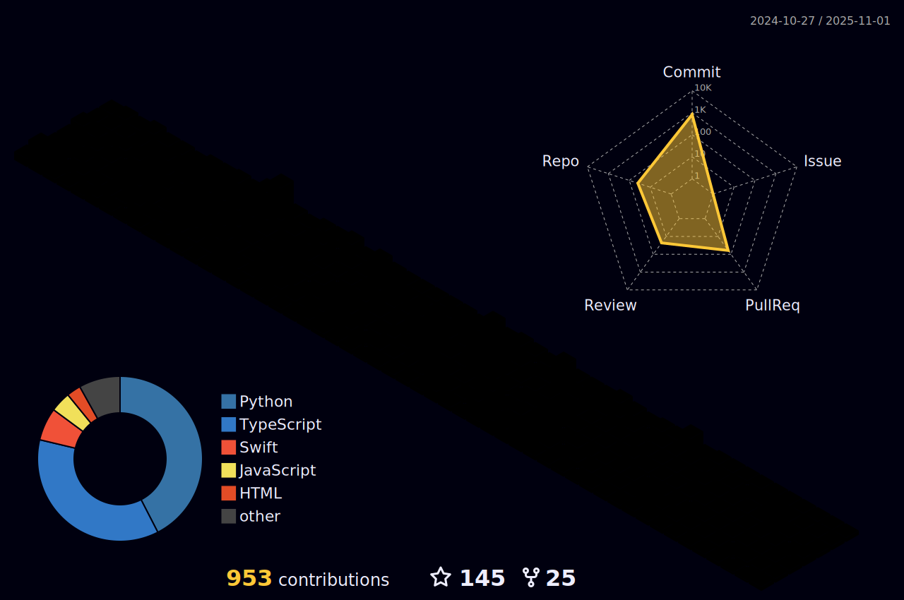

# Hola a todos ! 
## Click here to viist my website -> [(www.adityaseth.me)](https://adityaseth.me)


</a>
<a href="https://github.com/AdityaSeth777?tab=followers"></a>
<a href ="https://metrics.lecoq.io/insights/AdityaSeth777"></a>

</p>


```python
Name = "Aditya Seth"
Interests = ["Coding", "Cryptography", "Problem Solving", "Graphic Editing", "Photography", "Exploring various OS :)"]
Languages = ["C", "C++", "Python", "HTML", "CSS", "Kotlin"]
OS = ["Zorin", "Ubuntu", "BlackArch", "Nitrux", "Windows", "Elementary OS", "Kali Linux", "Ubuntu Unity", "Manjaro", "Arch"]

```
<!-- <div align=center>
  
[](https://github.com/AdityaSeth777)
</div> !-->

  
### Wanna listen to what I am listening to ? :)  

<div align=center> 
  
[](https://spotify-github-profile.vercel.app/api/view?uid=setha4195&redirect=true)
  
</div>

## 💻 My workspace


### Tech Stack:
<div align=center>  


<!--  !-->


</div>


### Connect with me:
<div align=center>

<a href="https://www.linkedin.com/in/aditya-seth-270833233" alt="Aditya Seth | LinkedIn"></a> &nbsp;
<a href="https://instagram.com/codificador_anonimo?igshid=YmMyMTA2M2Y=" alt="codificador_anonimo | Instagram"></a> &nbsp;
<a href="mailto:adityaseth.cse@gmail.com" alt="Aditya Seth | Gmail">
<a href="https://discordapp.com/users/Aditya Seth#4753" alt="Aditya Seth | Discord">
<a href="https://www.hackerrank.com/adityaseth_cse" alt="Aditya Seth | HackerRank">
<a href="https://www.cloudskillsboost.google/public_profiles/b8eb9de8-382a-4ff8-9088-7ea496aac45d" alt="Aditya Seth | Google Cloud Skills">
<a href="https://www.quora.com/profile/Aditya-Seth-133?ch=10&oid=1734427191&share=5335f444&srid=hzXNBO&target_type=user" alt="Aditya Seth | Quora">
<a href="https://auth.geeksforgeeks.org/user/adityaseth_777/" alt="Aditya Seth | Quora">
  </div>

### Statistics :  
<div align="center">
   <a href="https://github.com/AdityaSeth777">
 
   
   </a>
   <a href="https://github.com/AdityaSeth777">
   
   <br/>
   </a>
</div>
 
<div align=center> 
<p></p>

</div>

<div align=center>            
   <a href="https://github.com/AdityaSeth777">
   
   
   </a>
</div>

  
<div align=center>
   <a href="https://github.com/AdityaSeth777" target="_blank">
   
   </a>
</div> 
<div align=center>
   <a href="https://github.com/AdityaSeth777">
   
   
   </a>
</div>

<div align=center>
   <a href="https://github.com/AdityaSeth777">            
   
   </a>
</div>

[](https://holopin.io/@adityaseth777)


[](https://github.com/AdityaSeth777)


[](https://github.com/AdityaSeth777/github-profile-trophy)
  
  